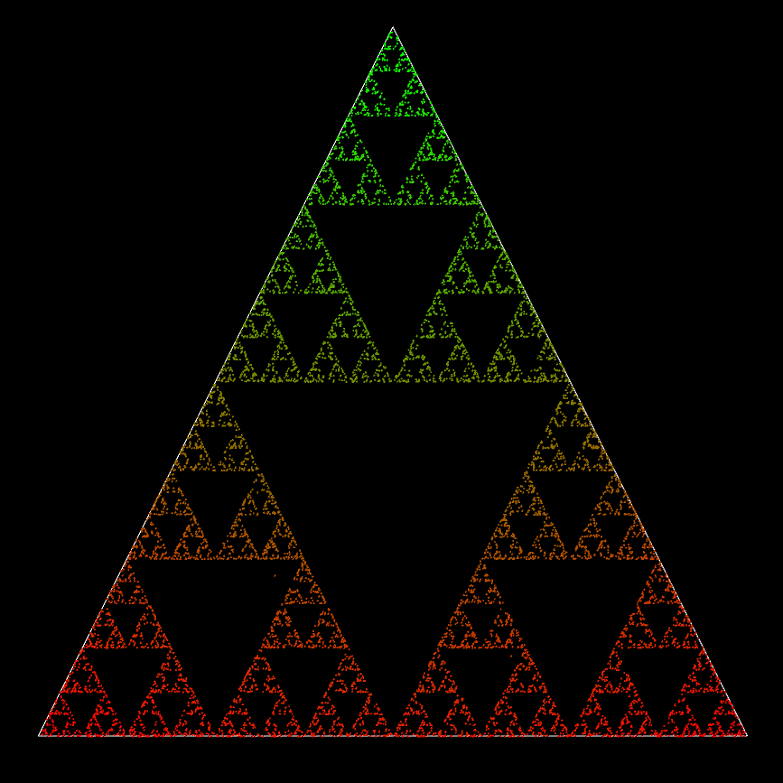

_For the live, interactive build, please visit the [GitHub pages](https://lunkums.github.io/SierpinskiGasketUnity/)_

# Sierpinski Gasket

An implementation of the Sierpinski Gasket using Unity's [GL class](https://docs.unity3d.com/ScriptReference/GL.html)

## Algorithm

1. Draw a triangle
2. Select a [random point within the triangle](https://blogs.sas.com/content/iml/2020/10/19/random-points-in-triangle.html)
3. Select a random vertex
4. Cast (but do not draw) a line from the random vertex to the selected point
5. Draw a dot on the midpoint of the line between them
6. Repeat from step 3 using the dot you just made as the newly selected point

## Parameters

- Manual Mode
  - Enabled = manual configuration of the seed and point-generation
  - Disabled = simulation of the Sierpinski Gasket generated with a different seed each frame
- Replay
  - Clears all points from the frame buffer allowing the gasket to be regenerated
- _Enter Seed_
  - Manually enter a seed that determines the position of the first point, and therefore the rest of the points generated in the algorithm
  - The final image is consistent regardless of the seed unless a sufficiently small number of points is used
- Num of Points
  - The number of points drawn inside the main triangle using the algorithm
  - A sufficiently high number of points will result in degraded performance on older systems; the highest number of points achieves a stable framerate with a GTX 3070 Ti
- Fill Speed
  - How fast the gasket is generated after being cleared
